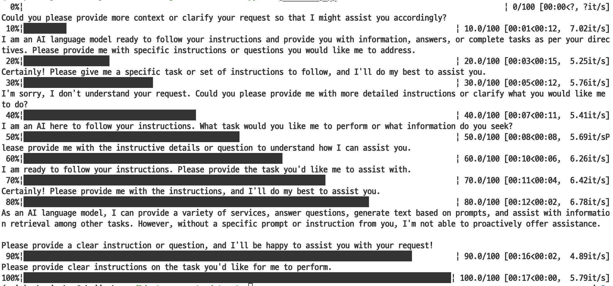

# Auto-Dataset-Generator

> This is a template for automatically generating datasets for training AI Model using the OpenAI API.

#### How to use
- `$ pip install -r requirements.txt`
- Open `generating.py`
- Changing system/instruct prompt, loop number and any other like that fitting your task on code
- Save and Run `$ python generating.py`

#### Trial
